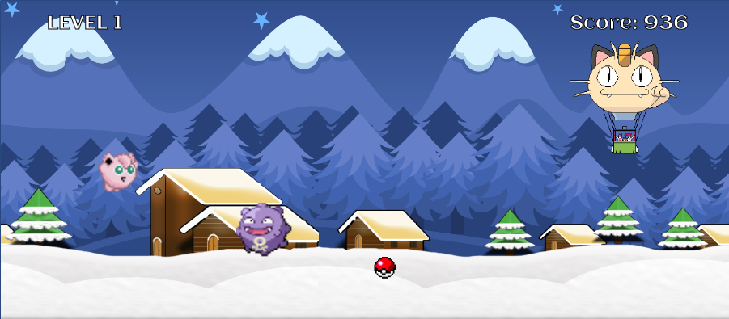

# jinglepuff

[Play now!](https://kokokola694.github.io/jinglepuff/)



## About
Oh no, Team Rocket has stolen the townspeople's Pokemon and is getting away! But lucky for us, we can count on our hero, the dependable Jigglypuff, to save the day.

## How to Play
* Press SPACE to jump and avoid Team Rocket's Pokemon!
* Tapping SPACE twice will result in a double-jump.
* Pick up items to collect bonus points.
* Get the highest score you can!

## Technologies
* Vanilla JavaScript was used for the game logic, with classes for the player, background, score, enemies & items
* HTML5 Canvas for rendering sprites and images

## Features
### Class Inheritance
Similarly functioning objects were grouped up in classes to DRY up code. For example, the `Enemy` class was used to wrap the different enemies (`Koffing` and `Meowth`). These objects all share the same properties and methods (ex. `xPos`, `speed`, `renderSprite()`, `render()`) so implementing class inheritance allowed me to reduce the amount of repeating code. For example, the simplest `Enemy` (`Koffing`) didn't need its own `render` method!

```javascript
class Enemy {
  constructor(props) {
    this.xPos = props.xPos;
    this.yPos = props.yPos;
    this.speed = props.speed;
    ...
  }

  renderSprite(context) {
    ...
  }

  render(context) {
    this.renderSprite(context);
    this.xPos -= this.speed;
    this.frameCount += 1;
  }
}


class Koffing extends Enemy {
  constructor(props) {
    super(props);
    this.width = 70;
    this.height = 70;
    this.sprites = new Image();
    this.sprites.src = './assets/images/koffing-sprites.png';
  }

  ...

  renderSprite(context) {
    if (this.frameCount < 15) {
      this.extractSprite(context, KOFFING_SPRITES["reg1"]);
    } else if (this.frameCount < 30) {
      this.extractSprite(context, KOFFING_SPRITES["reg2"]);
    } ...
  }
}
```

### Parallax Scrolling
By implementing two extra sets of canvases, the game showcases parallax backgrounds panning. There are two sets of backgrounds: the "far" mountains and the "near" ground and houses. Each one was rendered using its own properties, with the most notable one being `speed`, which pans the visuals at different paces and creates the parallax effect.

```javascript
const FAR_BG = {
  speed: 0.6,
  src: './assets/images/winter1.png',
  imgCoord: [...],
  canvasCoord1: [...],
  canvasCoord2: [...]
}

const NEAR_BG = {
  speed: 3,
  src: './assets/images/snow_houses.png',
  imgCoord: [...],
  canvasCoord1: [...],
  canvasCoord2: [...]
}
```

### Animation (Sprites & Gravity)
Character movement, background panning, and score updating were achieved by using HTML5 Canvas and requesting animation frames to be rendered to the browser. For every rendering of the game, each of these items are updated and then re-rendered using `requestAnimationFrame`.

```javascript
render () {
  if (!this.gameOver && !this.paused) {
    requestAnimationFrame(this.render);
    this.player.render(this.context);
    this.enemies.render(this.context);
    this.items.render(this.context);
    this.background.render(this.context);
    ...
  }
```
For example, sprites were animated by assigning certain sprites for certain character actions (ex. jumping, falling, walking). Walking sprites were set to change every few frames in `renderSprite()` to emulate smooth animated movement.

```javascript
renderSprite(context) {
  const frames = 9;
  if (this.vel > 0) {
    this.extractSprite(context, SPRITES["fall"]);
  } else if (this.jumping) {
    this.extractSprite(context, SPRITES["jump"]);
  } else if (this.frameCount < frames*1) {
    this.extractSprite(context, SPRITES["walk1"]);
  } else if (this.frameCount < frames*2) {
    this.extractSprite(context, SPRITES["walk2"]);
  }
  ...
}

render (context) {
  this.renderSprite(context);
  this.renderJump();
  this.frameCount += 1;
}
```

## Future Plans
* More enemies/obstacles added
* New items to pick up (ex. invincibility item)
* Add Firebase to store high scores globally
